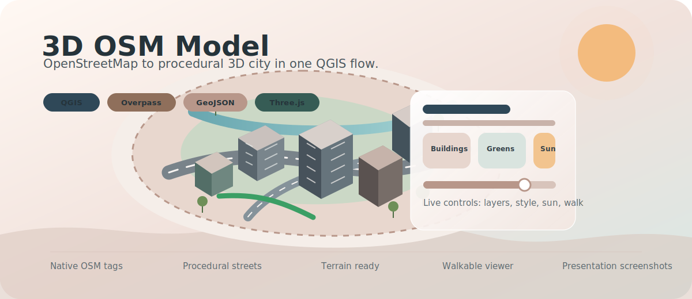
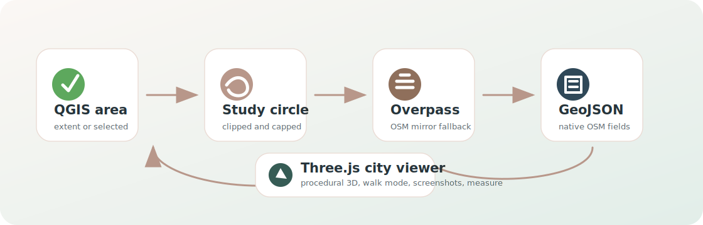
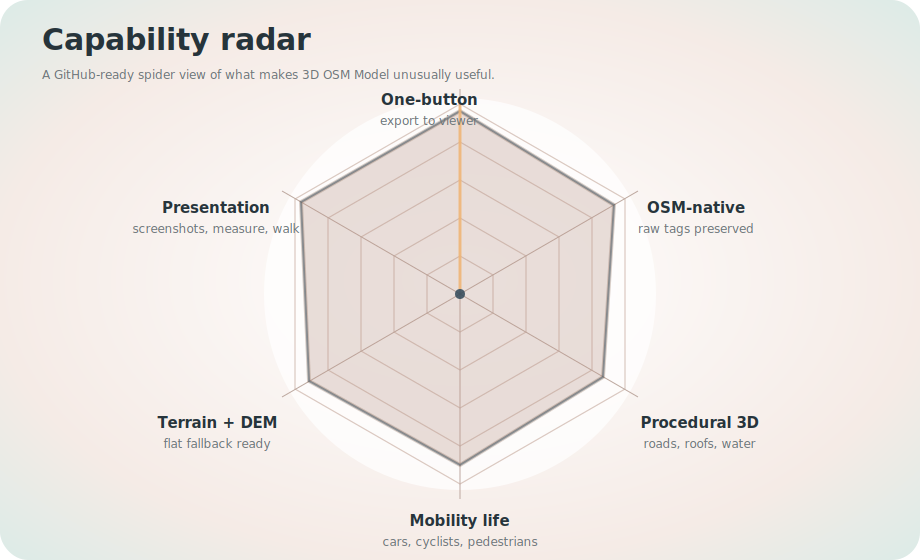

<p align="center">
  
</p>

<h1 align="center">3D OSM Model</h1>

<p align="center">
  <strong>One click from QGIS to an interactive OpenStreetMap city.</strong>
</p>

<p align="center">
  Select an area, download live OSM data, and open a polished Three.js 3D city viewer with procedural buildings, roads, sidewalks, water, trees, street furniture, traffic, pedestrians, and optional DEM terrain.
</p>

<p align="center">
  <a href="metadata.txt"></a>
  <a href="LICENSE"></a>
  
  
</p>

<p align="center">
  <a href="#quick-start">Quick start</a> |
  <a href="#why-it-matters">Why it matters</a> |
  <a href="#viewer-experience">Viewer</a> |
  <a href="docs/SHOWCASE.md">Showcase</a> |
  <a href="docs/ARCHITECTURE.md">Architecture</a> |
  <a href="docs/index.html">GitHub Pages</a>
</p>

---

## The Product Promise

3D OSM Model turns a small planning study area into a live, navigable city model without asking the user to prepare a 3D dataset first. It is designed for urban planners, educators, students, local governments, mobility teams, and anyone who needs a fast spatial story from OpenStreetMap.

The plugin keeps the workflow deliberately simple:

1. Pick the current map extent or selected polygon feature in QGIS.
2. Choose a boundary shape — inscribed circle, rounded rectangle, rectangle, or the exact polygon — and the plugin caps the request size.
3. It downloads OSM buildings, roads, cycleways, waterways, greens, trees, bus stops, benches, lamps, and bins.
4. It exports native-tag GeoJSON layers plus a manifest.
5. It opens a local browser viewer powered by the PlanX 3D City engine.

<p align="center">
  
</p>

## Quick Start

### Install for development

```powershell
$env:QGIS_PLUGINPATH = "C:\Users\YE\PyCharmMiscProject\qgis_plugins"
```

Restart QGIS, enable **3D OSM Model**, then open the plugin from the toolbar or plugin menu.

### Run the bundled sample viewer

The repository ships with a small sample city so the viewer is never empty.

```powershell
cd C:\Users\YE\PyCharmMiscProject\qgis_plugins\osm_3d_model
py -3 -m http.server 8120 --directory web
```

Open:

```text
http://127.0.0.1:8120/src/
```

### Use it inside QGIS

1. Zoom to a small area or select polygon feature(s).
2. Choose the study area source, boundary shape, and web theme in the dialog.
3. Optionally pick a DEM raster, or a basemap layer to drape under the city.
4. Click **Create OSM layers & export 3D viewer**.
5. Explore the generated city in the browser.

## Why It Matters

| Need | How the plugin helps |
| --- | --- |
| Fast urban context | Builds a 3D model directly from OSM without manual layer preparation. |
| Planning communication | Turns a map view into screenshots, walk-throughs, measurements, and live stakeholder demos. |
| Mobility reading | Separates car-capable roads, cycleways, sidewalks, pedestrians, cyclists, and traffic. |
| Public realm detail | Adds trees, water, benches, bus stops, street lamps, and bins when OSM contains them. |
| Terrain context | Uses an optional DEM while falling back gracefully to a clean flat base. |
| Global portability | Keeps native OSM tags such as `building`, `building_levels`, `highway`, `waterway`, `landuse`, and `width`. |

## Signature Features

<p align="center">
  
</p>

### One-button OSM to 3D

The plugin handles Overpass download, clipping, reprojection, layer export, manifest creation, local server startup, and browser launch in one flow.

### Study area, your shape

Pick how the study boundary is derived from your map extent or selected polygon, then let the plugin clamp it to a polite maximum request size:

| Boundary shape | What you get |
| --- | --- |
| **Inscribed circle** | The largest circle that fits inside the area — the classic, clean look (default). |
| **Rounded rectangle** | The bounding box with generously rounded corners. |
| **Rectangle (extent)** | The bounding box, kept tidy — corners are softened just slightly on the base. |
| **Exact polygon** | The selected polygon used as-is (falls back to the canvas rectangle). |

Whatever shape you choose, the model base extends 5 m beyond the boundary with softly rounded corners, so the city always sits on a small, presentation-ready platform. OSM data stays clipped to the inner boundary; only the platform uses the wider ring.

### Easy colour themes

Pick a **Web theme** in the dialog to set the colour palette of the exported 3D city. Themes recolour the **content only** — buildings, roads, the base/island and its skirt, greens, and roof texture — and never the viewer's toolbar or panels.

| Theme | Mood |
| --- | --- |
| **Plugin tones** | Salmon and warm grey — the signature look (default). |
| **Tinted gray + teal** | Cool neutral greys with teal accents. |
| **Teal + salmon** | Deep teal streets against a warm salmon base. |
| **Light purple + soft black** | Light lavender base with near-black roads. |
| **Warm sand + slate** | Warm sand platform with slate roofs and roads. |

The chosen theme travels with the export and is applied automatically when the viewer opens. Re-opening the same export keeps any manual colour edits you made in the Style dock.

### Native OpenStreetMap schema

The export does not translate data into a local-only schema. The viewer maps OSM fields directly:

| Viewer meaning | OSM/native field |
| --- | --- |
| Building function | `building` |
| Floor count | `building_levels`, `height`, `roof:levels` logic |
| Road hierarchy | `highway` |
| Waterway class | `waterway` |
| Green/land category | `leisure`, `landuse`, `natural` |
| Width hints | `width` |

### Procedural city engine

The viewer renders:

- Buildings with function-aware default floors, roof massing, facade textures, and per-function style controls.
- Roads as procedural ribbons with lane markings and sidewalks on both sides.
- Dedicated OSM cycleways as green bike-lane strips with optional cyclists.
- Waterways as flowing ribbons whose width follows OSM class or width tags.
- Realistic trees, pedestrians, vehicles, bus stops, benches, lamps, and bins.
- Golden-hour sun, weather, fog, bloom, SSAO, bookmarks, screenshots, measuring, minimap, walk mode, and a live dashboard.

## Viewer Experience

The browser viewer is intentionally lean and English-only. The toolbar focuses on the controls that matter during a demo:

| Control | Purpose |
| --- | --- |
| Layers | Toggle buildings, roads, bike lanes, water, greens, trees, furniture, cars, cyclists, pedestrians, and terrain. |
| Style | Edit road color, textures, assets, trees, buildings, roofs, block categories, and function-specific facades. |
| Scene & Sun | Time of day, solar animation, weather, fog, theme, shadow quality, bloom, traffic speed, densities, DEM mesh, and bookmarks. |
| Model Studio | Upload and tune GLB models for trees and street furniture categories. |
| Basemap & Texture | Drape a QGIS basemap under the city and restyle it live: opacity, blend mode (Multiply, Screen, Add, Difference), brightness, contrast, saturation, tint, and shadow catching. |
| Walk mode | Enter the model at pedestrian eye height with WASD controls. |
| Screenshot | Save a clean PNG from the current view. |
| Measure | Pick two ground points and read distance. |
| Help | See shortcuts without leaving the viewer. |

## Showcase Playbook

Use the showcase recipes when presenting the plugin or preparing GitHub screenshots:

| Scenario | What to demonstrate |
| --- | --- |
| Compact neighborhood | One-button export, dashboard counts, building floors, roads, sidewalks, cars, pedestrians. |
| Waterfront corridor | Waterway ribbons, trees, greens, sun presets, measurement tool. |
| Complete street | Bike lanes, cyclists, sidewalks, bus stops, lamps, benches, and traffic density. |
| Campus or civic core | Selected polygon workflow, walk mode, Model Studio assets, screenshot export. |
| Hillside context | Optional DEM, terrain base, time-of-day shadows, topography view. |

See [docs/SHOWCASE.md](docs/SHOWCASE.md) for a full media and demo script.

## Repository Map

| Path | Role |
| --- | --- |
| `main_plugin.py` | QGIS plugin lifecycle, action wiring, export orchestration. |
| `dialog.py` | QGIS dialog, study area options, DEM selector, status and summary UI. |
| `osm_download.py` | Overpass query, mirror fallback, OSM tag parsing, vector layer creation. |
| `builder.py` | Study-area boundary shapes, clipping, reprojection, GeoJSON export, manifest writing. |
| `server.py` | Local HTTP server for the viewer. |
| `web/src/` | Three.js viewer, UI, controls, styling, procedural 3D scene. |
| `web/data/` | Bundled sample city and runtime export sink. |
| `docs/` | GitHub showcase, architecture notes, Pages landing page, visual assets. |

## GitHub Pages

This repository includes a polished static landing page at [docs/index.html](docs/index.html). To publish it on GitHub:

1. Open repository **Settings**.
2. Go to **Pages**.
3. Set **Source** to the main branch and `/docs` folder.
4. Save.

No plugin version bump is required for documentation-only updates.

## Data, Credits, and License

3D OSM Model is developed by Yusuf Eminoglu at Dokuz Eylul University, Department of City and Regional Planning.

Map data is provided by OpenStreetMap contributors under the ODbL. Keep the OSM attribution visible when sharing exports, screenshots, or demos.

The plugin code is released under the [MIT License](LICENSE). The viewer engine is built on Three.js and the PlanX 3D City workflow.
