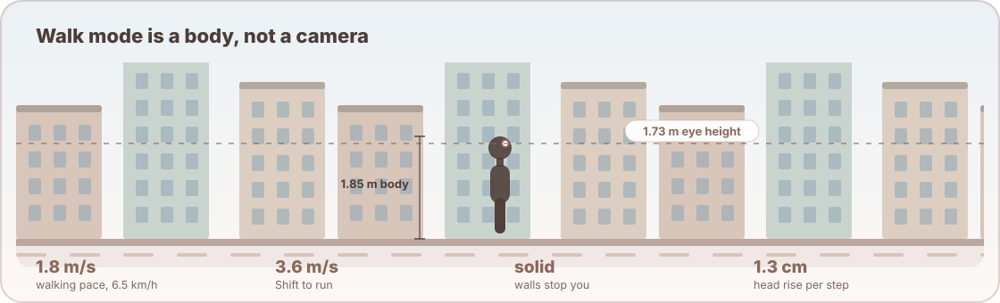
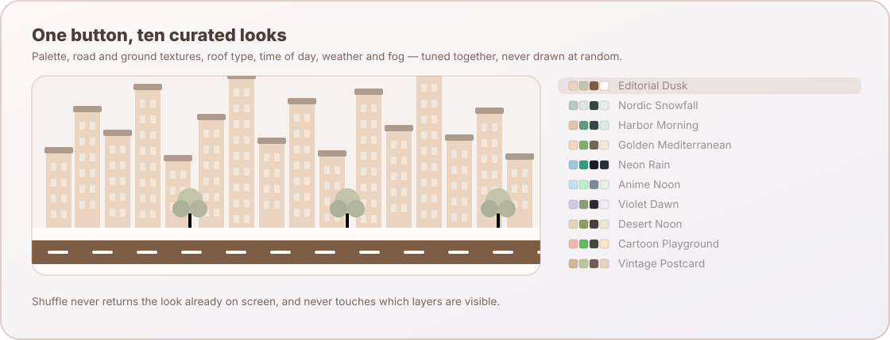

<p align="center">
  
</p>

<h1 align="center">3D OSM Model</h1>

<p align="center">
  <strong>One click from QGIS to an interactive OpenStreetMap city.</strong>
</p>

<p align="center">
  Select an area, download live OSM data, and open a polished Three.js 3D city viewer with procedural buildings, roads, sidewalks, water, trees, street furniture, traffic, pedestrians, and optional DEM terrain.
</p>

<p align="center">
  <a href="metadata.txt"></a>
  <a href="LICENSE"></a>
  <a href="https://yusufeminoglu.github.io/osm_3d_model/"></a>
  
  
</p>

<p align="center">
  <a href="#quick-start">Quick start</a> |
  <a href="#why-it-matters">Why it matters</a> |
  <a href="#viewer-experience">Viewer</a> |
  <a href="docs/SHOWCASE.md">Showcase</a> |
  <a href="docs/ARCHITECTURE.md">Architecture</a> |
  <a href="docs/index.html">GitHub Pages</a>
</p>

---

## 📖 Documentation

**[Comprehensive Academic Reference Manual](https://yusufeminoglu.github.io/osm_3d_model/)** — complete documentation of every feature, parameter, and workflow. Hosted on GitHub Pages.


## The Product Promise

3D OSM Model turns a small planning study area into a live, navigable city model without asking the user to prepare a 3D dataset first. It is designed for urban planners, educators, students, local governments, mobility teams, and anyone who needs a fast spatial story from OpenStreetMap.

The plugin keeps the workflow deliberately simple:

1. Pick the current map extent or selected polygon feature in QGIS.
2. Choose a boundary shape — inscribed circle, rounded rectangle, rectangle, or the exact polygon — and the plugin caps the request size.
3. It downloads OSM buildings, roads, cycleways, waterways, water areas (lakes, ponds, riverbanks), greens, car parks, pedestrian squares, trees, bus stops, benches, lamps, and bins.
4. It exports native-tag GeoJSON layers plus a manifest.
5. It opens a local browser viewer powered by the PlanX 3D City engine.

<p align="center">
  
</p>

## Quick Start

### Install for development

```powershell
$env:QGIS_PLUGINPATH = "C:\Users\YE\PyCharmMiscProject\qgis_plugins"
```

Restart QGIS, enable **3D OSM Model**, then open the plugin from the toolbar or plugin menu.

### Run the bundled sample viewer

The repository ships with a small sample city so the viewer is never empty.

```powershell
cd C:\Users\YE\PyCharmMiscProject\qgis_plugins\osm_3d_model
py -3 -m http.server 8120 --directory web
```

Open:

```text
http://127.0.0.1:8120/src/
```

### Use it inside QGIS

1. Zoom to a small area or select polygon feature(s). On an empty project, click **Add OSM basemap to the map** once to get live OpenStreetMap tiles to navigate with — the same layer is then offered as the underlay beneath the 3D city.
2. Choose the study area source, boundary shape, and coordinated map/web theme in the dialog. Editorial Paper is the warm, legible default.
3. Optionally pick a DEM raster, or a different basemap layer to drape under the city.
4. Click **Create OSM layers & export 3D viewer**.
5. Explore the generated city in the browser.

## Why It Matters

| Need | How the plugin helps |
| --- | --- |
| Fast urban context | Builds a 3D model directly from OSM without manual layer preparation. |
| Planning communication | Turns a map view into screenshots, walk-throughs, measurements, and live stakeholder demos. |
| Mobility reading | Separates car-capable roads, cycleways, sidewalks, pedestrians, cyclists, and traffic. |
| Public realm detail | Adds trees, water, benches, bus stops, street lamps, and bins when OSM contains them. |
| Terrain context | Uses an optional DEM while falling back gracefully to a clean flat base. |
| Global portability | Keeps native OSM tags such as `building`, `building_levels`, `highway`, `waterway`, `landuse`, and `width`. |

## Signature Features


### One-button OSM to 3D

The plugin handles Overpass download, clipping, reprojection, layer export, manifest creation, local server startup, and browser launch in one flow.

### Study area, your shape

Pick how the study boundary is derived from your map extent or selected polygon, then let the plugin clamp it to a polite maximum request size:

| Boundary shape | What you get |
| --- | --- |
| **Inscribed circle** | The largest circle that fits inside the area — the classic, clean look (default). |
| **Rounded rectangle** | The bounding box with generously rounded corners. |
| **Rectangle (extent)** | The bounding box, kept tidy — corners are softened just slightly on the base. |
| **Exact polygon** | The selected polygon used as-is (falls back to the canvas rectangle). |

Whatever shape you choose, the model base extends 5 m beyond the boundary with softly rounded corners, so the city always sits on a small, presentation-ready platform. OSM data stays clipped to the inner boundary; only the platform uses the wider ring.

### Easy colour themes

Pick a **Map & web theme** in the dialog to style both the native QGIS layer group and exported 3D city. QGIS receives categorized buildings and ground uses, hierarchy-aware metric road widths, coordinated water/trees/furniture, and a presentation base beneath the data. The browser theme recolours the **content only** — never the viewer toolbar or panels.

| Theme | Mood |
| --- | --- |
| **Editorial Paper** | Warm ivory paper, brown hierarchy roads, muted greens and elegant building pastels (default). |
| **Plugin tones** | Salmon and warm grey — the original signature look. |
| **Tinted gray + teal** | Cool neutral greys with teal accents. |
| **Teal + salmon** | Deep teal streets against a warm salmon base. |
| **Light purple + soft black** | Light lavender base with near-black roads. |
| **Warm sand + slate** | Warm sand platform with slate roofs and roads. |
| **Anime** | Bright cel-shaded pastels on a light ground. |
| **Cartoon** | Bold primary colours over dark roads. |
| **Pixar** | Warm, friendly creams and oranges. |
| **Futuristic** | Dark neon base with cyan and violet glass towers. |
| **Classic era** | Vintage sepia stone with terracotta tile roofs. |

The chosen theme travels with the export and is applied automatically when the viewer opens. Re-opening the same export keeps any manual colour edits you made in the Style dock.

Building walls come from the photo-based **Residential A–F** and **Urban A–E**
facade sets: every reseed — an asset theme, a colour theme, a shuffled look —
draws three Residential walls for each Urban one and uses all six residential
facades before any repeats, so the city reads as buildings with windows rather
than flat coloured boxes. Any wall can still be changed per function in the
Style dock.

### Walk mode, from a real body

<p align="center">
  
</p>

Walk mode is lived from inside a body rather than flown as a low camera. Every
vertical dimension derives from one setting — the walker's stature, **1.85 m** by
default — using standard anthropometry:

| Quantity | Value at 1.85 m | Source |
| --- | --- | --- |
| Standing eye height | 1.73 m | 0.936 × stature |
| Crouched eye height | 1.11 m | 0.60 × stature |
| Walking pace | 1.8 m/s · 6.5 km/h | a brisk walk |
| Run (Shift) | 3.6 m/s · 13.0 km/h | |
| Stride | one step per 0.78 m | drives the head movement |

Buildings are solid — each horizontal axis is resolved separately, so a wall is
slid along rather than bringing you to a dead stop in a corner. The head rises
and falls twice per stride and sways once, scaled by how fast the body is really
travelling, so standing still is perfectly still. Entering walk mode lands you
where you were looking, and you cannot step off the edge of the base. Body
height, walking pace, solid buildings and head movement are all in the
**Scene & Sun** dock; the HUD shows the live eye height and speed.

### Curated looks and the cinematic tour

<p align="center">
  
</p>

A theme is a palette. A **look** is the whole composition — palette, road and
ground textures, roof type and massing, time of day, weather and fog — tuned
together so it reads the way it was designed to. The viewer ships ten, and the
dice button in the toolbar (or `L`) applies one at random. It is a curated
draw, not a random one: the shuffle picks from the ten and never returns the
look already on screen, and it never touches which layers are visible, so it
cannot switch heavy layers back on behind you. The **Looks** dock lists all ten
with a palette swatch, for picking one deliberately.

| Look | Mood |
| --- | --- |
| **Editorial Dusk** | Warm paper palette, low late-afternoon sun, soft civic massing. |
| **Nordic Snowfall** | Cool grey-teal city under falling snow and flat winter light. |
| **Harbor Morning** | Teal streets and salmon facades in clean early side-light. |
| **Golden Mediterranean** | Terracotta and stucco at golden hour — the postcard shot. |
| **Neon Rain** | Night glass towers, wet asphalt and bloom-lit rain. |
| **Anime Noon** | Bright cel pastels, hard noon shadows, no haze. |
| **Violet Dawn** | Lilac blocks against soft black roads in first light and mist. |
| **Desert Noon** | Sand and slate, dry air, deep contact shadows. |
| **Cartoon Playground** | Bold primaries under dark pyramid roofs, mid-afternoon light. |
| **Vintage Postcard** | Sepia stock, cobbled streets, heavy cornices, late sun. |

The play button (or `T`) runs a **cinematic tour**: five shots over 35 seconds —
establishing orbit, district sweep, descent, street level, golden-hour rise —
with the sun advancing from morning to dusk. Every shot is expressed as a
fraction of the model's own extent, so the same choreography frames a
four-hectare courtyard and a 300-hectare district. Record it straight from
Export Studio for a finished clip. The tour hands the camera, field of view and
time of day back exactly as it found them, and any click, scroll or `Esc` stops
it early.

### Native OpenStreetMap schema

The export does not translate data into a local-only schema. The viewer maps OSM fields directly:

| Viewer meaning | OSM/native field |
| --- | --- |
| Building function | `building` |
| Floor count | `building_levels`, `height`, `roof:levels` logic |
| Road hierarchy | `highway` |
| Waterway class | `waterway` |
| Green/land category | `leisure`, `landuse`, `natural` |
| Width hints | `width` |

### Procedural city engine

The viewer renders:

- Buildings with function-aware default floors, roof massing, facade textures, a subtle per-building shade variation, and per-function style controls.
- Roads as procedural ribbons with lane markings and sidewalks on both sides.
- Dedicated OSM cycleways as green bike-lane strips with optional cyclists.
- Waterways as flowing ribbons whose width follows OSM class or width tags.
- Water areas (lakes, ponds, reservoirs, riverbanks, bays) as flat blue water surfaces.
- Parks, woods and forests planted with scattered procedural trees (capped for performance) so green areas read as wooded.
- Car parks (`amenity=parking`) as flat paved asphalt-grey areas.
- Pedestrian squares and plazas (`highway=pedestrian`/`footway` areas, `place=square`, marketplaces) as paved stone ground.
- Realistic trees, pedestrians, vehicles, bus stops, benches, lamps, and bins.
- Golden-hour sun, weather, fog, bloom, SSAO, bookmarks, advanced still/document/video export, measuring, minimap, walk mode, and a live dashboard.

## Viewer Experience

The browser viewer is intentionally lean and English-only. The toolbar focuses on the controls that matter during a demo:

| Control | Purpose |
| --- | --- |
| Layers | Toggle buildings, roads, bike lanes, water, greens, trees, furniture, cars, cyclists, pedestrians, and terrain. |
| Style | Edit road color, textures, assets, trees, buildings, roofs, block categories, and function-specific facades. |
| Scene & Sun | Time of day, solar animation, weather, fog, theme, shadow quality, bloom, traffic speed, densities, DEM mesh, and bookmarks. |
| Model Studio | Upload and tune GLB models for trees and street furniture categories. |
| Basemap & Texture | Drape a QGIS basemap under the city and restyle it live: opacity, blend mode (Multiply, Screen, Add, Difference), brightness, contrast, saturation, tint, and shadow catching. |
| Looks | Ten curated compositions of palette, textures, massing and light, with palette swatches. |
| Randomize look | One click (or `L`) applies a curated look at random, never repeating the current one. |
| Cinematic tour | One click (or `T`) plays a five-shot, 35-second flight; `Esc` or any camera input stops it. |
| Walk mode | Stand in the model as a 1.85 m person: eyes at 1.73 m, a 1.8 m/s walking pace, solid buildings, and a gait you can feel. WASD, Shift to run, C to crouch. |
| Export Studio | Export clean PNG/JPEG/WebP renders, PDF pages, embedded SVG, self-contained HTML snapshots, clipboard PNGs, or record the live canvas as WebM/MP4 when supported. Includes viewport, Full HD, QHD, 4K, custom-size, quality, frame-rate, and bitrate controls. |
| Measure | Pick two ground points and read distance. |
| Help | See shortcuts without leaving the viewer. |
| GitHub | Opens the plugin's repository. A star helps it reach more planners. |

## Showcase Playbook

Use the showcase recipes when presenting the plugin or preparing GitHub screenshots:

| Scenario | What to demonstrate |
| --- | --- |
| Compact neighborhood | One-button export, dashboard counts, building floors, roads, sidewalks, cars, pedestrians. |
| Waterfront corridor | Waterway ribbons, trees, greens, sun presets, measurement tool. |
| Complete street | Bike lanes, cyclists, sidewalks, bus stops, lamps, benches, and traffic density. |
| Campus or civic core | Selected polygon workflow, walk mode, Model Studio assets, 4K stills, PDF handouts, or a recorded fly-through. |
| Hillside context | Optional DEM, terrain base, time-of-day shadows, topography view. |

See [docs/SHOWCASE.md](docs/SHOWCASE.md) for a full media and demo script.

## Repository Map

| Path | Role |
| --- | --- |
| `main_plugin.py` | QGIS plugin lifecycle, action wiring, export orchestration. |
| `dialog.py` | QGIS dialog, study area options, DEM selector, status and summary UI. |
| `osm_download.py` | Overpass query, mirror fallback, OSM tag parsing, vector layer creation. |
| `builder.py` | Study-area boundary shapes, clipping, reprojection, GeoJSON export, manifest writing. |
| `server.py` | Local HTTP server for the viewer. |
| `web/src/` | Three.js viewer, UI, controls, styling, procedural 3D scene. |
| `web/src/looks.js` | Curated look catalogue and tour choreography — pure data, unit-tested in Node. |
| `web/src/walk.js` | Walk-mode body model: anthropometry, gait and the velocity integrator — unit-tested in Node. |
| `osm_download.py` | Overpass query, QGIS-native transport, mirror rotation with one retry, OSM tag parsing, vector layer creation. |
| `web/data/` | Bundled sample city and runtime export sink. |
| `docs/` | GitHub showcase, architecture notes, Pages landing page, visual assets. |

## GitHub Pages

This repository includes a polished static landing page at [docs/index.html](docs/index.html). To publish it on GitHub:

1. Open repository **Settings**.
2. Go to **Pages**.
3. Set **Source** to the main branch and `/docs` folder.
4. Save.

No plugin version bump is required for documentation-only updates.

## 🧩 Part of the PlanX ecosystem

This plugin is one of 15 open-source QGIS plugins for urban planning by the same author:

| Planning & analysis | CAD & production | 3D & visualization |
|---|---|---|
| [PlanX](https://github.com/YusufEminoglu/PlanX) — spatial-planning suite | [PlanX CAD Toolset](https://github.com/YusufEminoglu/PlanX-CAD) — drafting-grade CAD | [PlanX 3D City](https://github.com/YusufEminoglu/planx_3d_city) — Three.js city viewer |
| [GeoStats Lab](https://github.com/YusufEminoglu/planx_geostats) — spatial statistics | [EasyFillet](https://github.com/YusufEminoglu/EasyFillet) — tangent-arc fillet | [3D OSM Model](https://github.com/YusufEminoglu/osm_3d_model) — OSM → 3D city in browser |
| [Suitability Lab](https://github.com/YusufEminoglu/planx_suitability_lab) — raster MCDA | [Settlement Toolset](https://github.com/YusufEminoglu/PlanX-Settlement) — 9-stage settlement plans | [OSM Quick 3D](https://github.com/YusufEminoglu/osm_quick_3d) — OSM → native QGIS 3D |
| [DataCube Lab](https://github.com/YusufEminoglu/planx_datacube) — spatiotemporal cubes | [UIP Toolset](https://github.com/YusufEminoglu/PlanX-UIP) — Turkish master-plan automation | [Urban Procedural 3D](https://github.com/YusufEminoglu/planx_urban_procedural_3d) — parametric zoning lab |
| [Urban Resilience](https://github.com/YusufEminoglu/planx_urban_resilience) — 28 resilience tools | [ParcelFlux](https://github.com/YusufEminoglu/parcelflux) — parcel subdivision | [CartoLab](https://github.com/YusufEminoglu/planx_cartolab) — publication cartography |

## Data, Credits, and License

3D OSM Model is developed by Yusuf Eminoglu at Dokuz Eylul University, Department of City and Regional Planning.

Map data is provided by OpenStreetMap contributors under the ODbL. Keep the OSM attribution visible when sharing exports, screenshots, or demos.

The tile, Overpass, Three.js, and geotiff.js notices are collected in
[`THIRD_PARTY_NOTICES.md`](THIRD_PARTY_NOTICES.md).

The plugin code is released under the [MIT License](LICENSE). The viewer engine is built on Three.js and the PlanX 3D City workflow.
